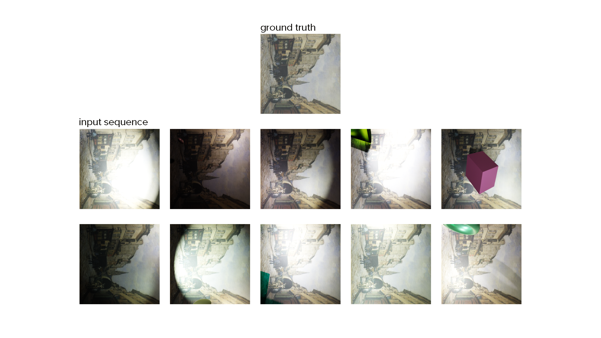
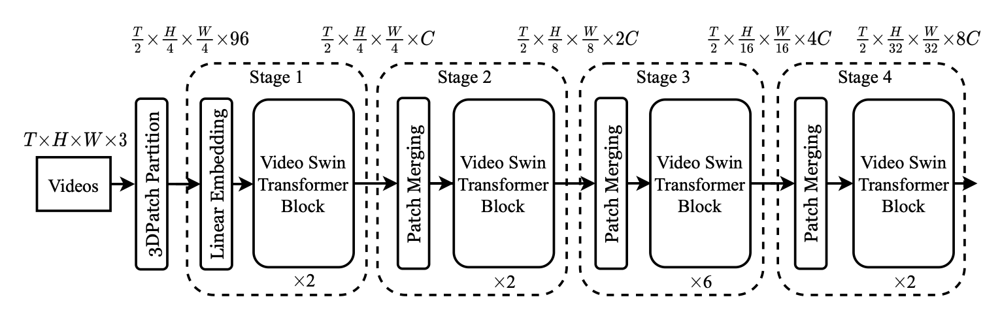
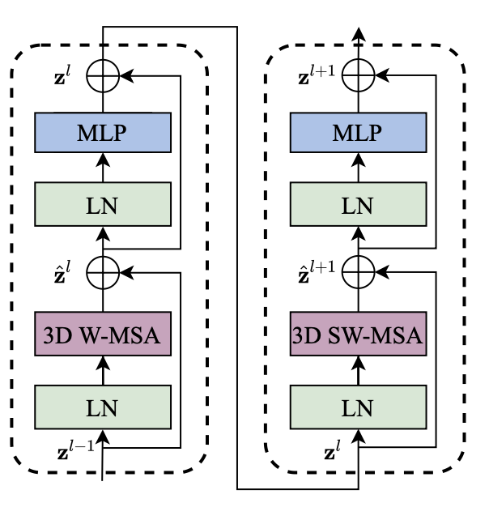
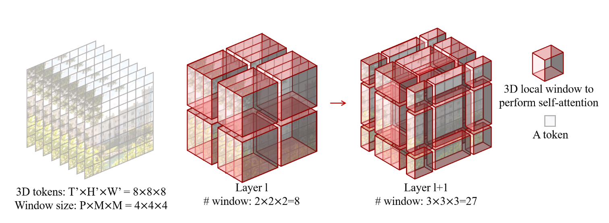
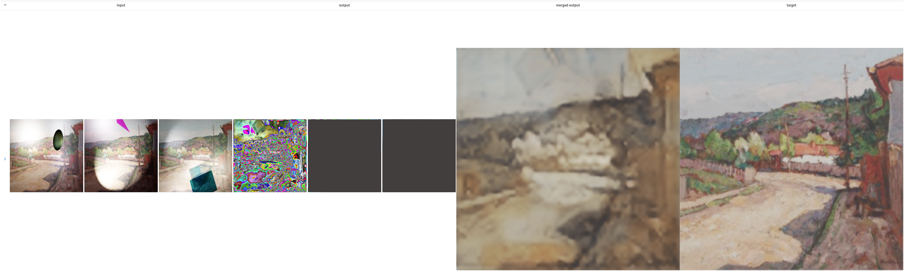
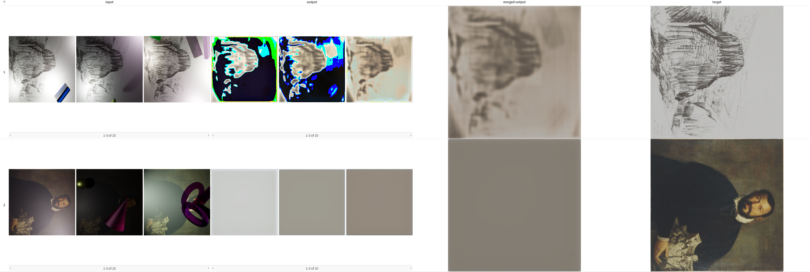
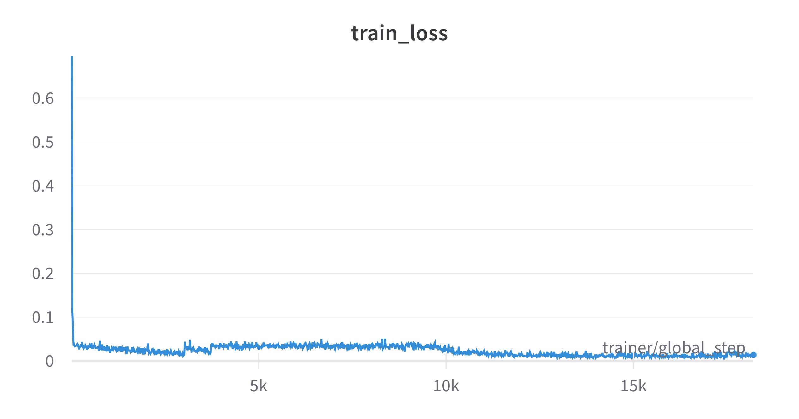
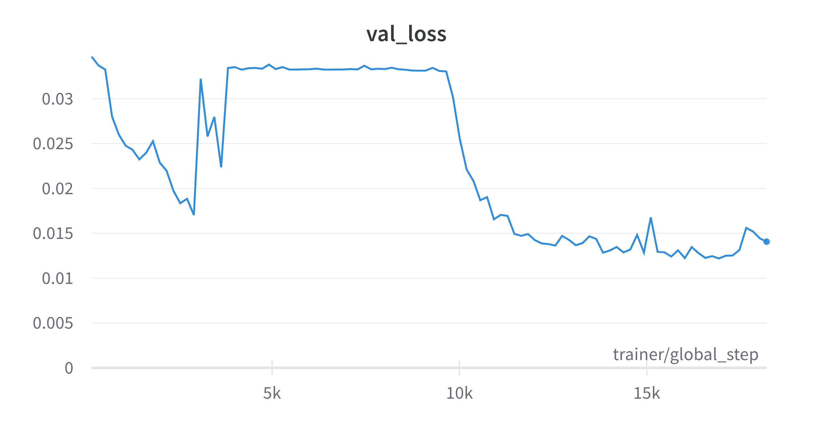

# HTCV: The beginning

## Introduction

*Can a model learn to decompose an augmented image into the original image and the augmented components--light, shadow and occlusion?*

**Fig 1:** *Example sequence of images with added augmentations, the first one being the original image.*

Given a sequence of augmented images (see Fig 1), can a model learn to predict the original image and the added augmentations for each sequence element?

We propose a novel dataset, called **SIAR** (S... I... A... R...), to investigate this question.
The dataset consists of 15618 sequences of 11 256x256 resolution images each.
Each sequence contains an original image and 10 augmented images.
The random augmentations are added to the original image in the order *shadow*, *occlusion*, and *light*.

> TODO: CREATE FIGURE FOR ARCHITECTURE

**Fig 2:** *Decomposer model architecture.*

To solve this task, we propose a novel model, which we call **Decomposer**.
Fig 2 shows the model architecture.
The model consists of two parts: an **encoder** and a **decoder**.
For the encoder, we use the Video SWIN Transformer that takes a sequence of images as input and encodes each image into a latent representation.
For the decoder, we use three branches, each a 3D UNet architecture, that all take the same latent representation of the encoder and decodes them into the original image and the augmentations.
One branch ($decoder_{gt}$) is trained to predict the original image.
The second branch ($decoder_{sl}$) is trained to predict the light and shadow masks.
The third branch ($decoder_{oc}$) is trained to predict the occlusions.

## The Video SWIN architecture
Video Swin Transformer is a spatiotemporal adaption of Swin transformer, which extends its application into the temporal dimension of videos along with the spatial dimensions of individual frames. It consists of four stages. The overall architecture can be seen in Figure 3. The input video has a size of T x H x W x 3, consisting of T frames each with H x W x 3 pixels. In the first stage at the **patch partitioning layer**, the input video is partitioned into T/2 x H/4 x W/4 3D patches/tokens, each of the size 2 x 4 x 4 x 3, i.e. 96 features. A linear embedding layer projects the features of each token to an arbitrary dimension denoted by C. The output is then passed into a Video Swin Transformer block. 

Each of the following three stages consists of a **patch merging layer** and **Video Swin Transformer blocks**. In the patch merging layer, each group of 2 x 2 neighbouring patches are concatenated. The concatenated features are then projected to half of their dimension by a linear layer. As a result, after each stage, the number of tokens is one fourth the original and the number of features of each token doubled. 

**Figure 3:** Overall architecture of Video Swin Transformer (tiny version: Swin-T). Other variants differ in the layer numbers and the value of C (number of hidden features in the first stage).

The architecture of two successive **Video Swin Transformer blocks** can be seen in figure 4. Its core resembles the multi-head self-attention layer (MSA) in the standard Transformer. However, in the second block, there is a 3D shifted window based multi-head self attention (3D SW-MSA) module, which aims to introduce connections across windows. Self-attention is performed on windows which are composed of tokens. Figure 5 shows how a window is shifted by 2 x 2 x 2 tokens. Other than that, in each block each MSA is followed by a 2-layer MLP, where Layer Normalization (LN) is applied before and residual connection after each module.

\
**Figure 4:** An illustration of two successive Video Swin Transformer blocks.
  

\
**Figure 5:** An illustrated example of 3D shifted windows.
  

## First steps

### Training only to predict the original image

**Fig 6:** *Example output of merged reconstruction model.*

We first trained a simpler version of the final Decomposer model to predict the original image - the *merged reconstruction model*. We here only used one decoder that models a many-to-many pipeline. We predict the original ground truth image 10 times and take the mean as our final output. We compute the MSE loss between that merged output and the ground truth.
We trained the model for 100 epochs with a batch size of 16 and the Adam optimizer with a learning rate of 0.001.

Fig 6 shows an example output of our model. The model is able to predict the original image quite well. However, it is not able to predict the exact shape of the object. It rather predicts a blurry and desaturated version of the object.

Nevertheless, we observe that only one out of the 10 output images contributes all colors and shapes to the merged output. All other predicted images are a continuos gray color, that is used to desaturate the oversaturated parts of the main output.

**This was not always the case!**

**Fig 7:** *Comparison between output in epoch 20 (above) and epoch 21 (below)*

We can clearly qualitatively observe that our model at epoch 21 fell into a local minimum that it was not able to escape from. We can see that the model at epoch 20 was able to predict the original image much better than the model at epoch 21.

This is also observable in the loss plot:

Training loss              |  Validation loss
:-------------------------:|:-------------------------:
  |  

**Fig 8:** *Training and validation plots for 100 epochs.*

We can see that the training loss, but the validation loss even more so, is very unstable. We can see that the validation loss is not decreasing monotonically. This is a clear indicator that our loss function is not smooth and prone to collapse.

In the next step, tackle the challenge of our decomposition learning task.