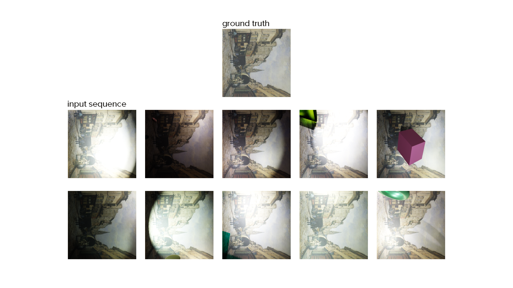

# HTCV: The beginning

## Introduction

*Can a model learn to deliberately decompose an augmented image into the main contents of the image and added light, shadows, and occlusions?*

**Fig 1:** *Example sequence of images with added augmentations and ground truth.*

Given a sequence of images (see. Fig 1), can a model learn to predict the single underlying image and the added augmentations for each sequence element?

We propose a novel dataset, called **SIAR** (S... I... A... R...), to investigate this question.
The dataset consists of 15618 sequences of 11 256x256 resolution images each.
Each sequence contains a single underlying image and 10 augmented views.
The random augmentations are added to the underlying image in the order *shadow*, *occlusion*, and *light*.

> TODO: CREATE FIGURE FOR ARCHITECTURE

**Fig 2:** *Decomposer model architecture.*

To solve this task, we propose a novel model, which we call **Decomposer**.
Fig 2 shows the model architecture.
The model consists of two parts: an **encoder** and a **decoder**.
For the encoder, we use the 3D SWIN architecture that takes a sequence of images as input and encodes each image into a latent representation.
For the decoder, we use three branches, each a 3D UNet architecture, that all take the same latent representation of the encoder and decodes them into the underlying image and the augmentations.
One branch ($decoder_{gt}$) is trained to predict the ground truth underlying image.
The second branch ($decoder_{sl}$) is trained to predict the light and shadow masks.
The third branch ($decoder_{oc}$) is trained to predict the occlusions.

## The 3DSWIN architecture
> TODO: WRITE ABOUT 3DSWIN

## First steps

### Training only to predict the underlying image

**Fig 3:** *Example output of merged reconstruction model.*

We first trained a simpler version of the final Decomposer model to predict the underlying image - the *merged reconstruction model*. We here only used one decoder that models a many-to-many pipeline. We predict the original ground truth image 10 times and take the mean as our final output. We compute the MSE loss between that merged output and the ground truth.
We trained the model for 100 epochs with a batch size of 16 and the Adam optimizer with a learning rate of 0.001.

Fig 3 shows an example output of our model. The model is able to predict the underlying image quite well. However, it is not able to predict the exact shape of the object. It rather predicts a blurry and desaturated version of the object.

Nevertheless, we observe that only one out of the 10 output images contributes all colors and shapes to the merged output. All other predicted images are a continuos gray color, that is used to desaturate the oversaturated parts of the main output.

**This was not always the case!**

**Fig 4:** *Comparison between output in epoch 20 (above) and epoch 21 (below)*

We can clearly qualitatively observe that our model at epoch 21 fell into a local minimum that it was not able to escape from. We can see that the model at epoch 20 was able to predict the underlying image much better than the model at epoch 21.

This is also observable in the loss plot:

Training loss              |  Validation loss
:-------------------------:|:-------------------------:
  |  

**Fig 5:** *Training and validation plots for 100 epochs.*

We can see that the training loss, but the validation loss even more so, is very unstable. We can see that the validation loss is not decreasing monotonically. This is a clear indicator that our loss function is not smooth and prone to collapse.

In the next step, tackle the challenge of our decomposition learning task.