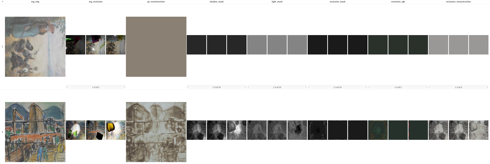
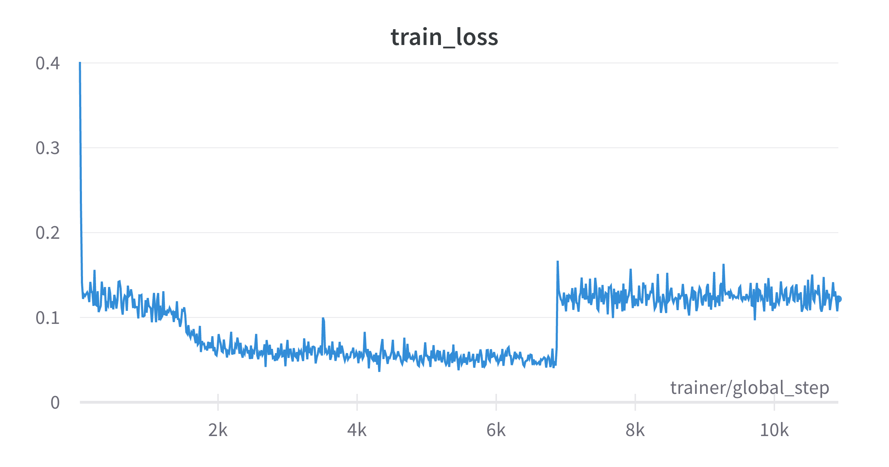
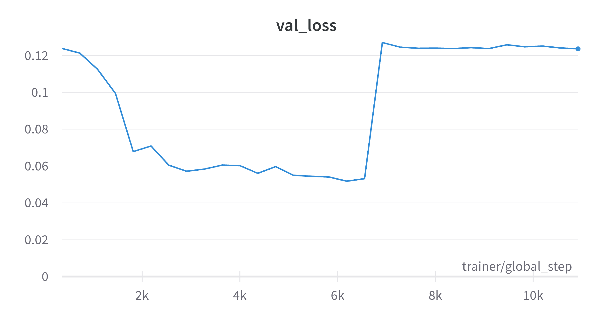

# HTCV: Tackling Decomposition Learning

Now that we saw how our model was capable of reconstructing the underlying image, let's try to teach it to differentiate between light, shadow and occlusions.

## Table of contents
1. [First attempts](#first-attempts) \
1.1 [Loss function](#loss-function) \
1.2 [Results](#results)
2. [Pre-training](#pre-training)
3. [Improving stability](#improving-stability)
4. [One step back](#one-step-back)


## First attempts
### Loss function
> TODO: Write about complete loss function (base_loss)

### Results
We trained our Decomposer model on our base (decomposition) loss for 30 epochs.

As we have seen previously our model seems to invoke a very unstable loss function and very unsmooth loss landscape. We once again observe proper decrease of the loss until at epoch 19 our model collapses and does not recover. We tried to train the model for longer, but it did not recover. 


**Fig 1:** *Qualitative results. Comparison between epoch 31 (above) and epoch 18 (below). Col 1 (1 element): original image, Col 2 (3 elements): augmented views of original image, Col 3 (1 element): reconstruction of original image, Col 4 (3 elements): predicted shadow masks for each sequence element, Col 5 (3 elements): predicted light masks for each sequence element, Col 6 (3 elements): predicted occlusion masks for each sequence element, Col 7 (3 elements): predicted occlusion RGB balues for each sequence element.*

In fig 1 we can qualitatively observe the performance before and after the collapse. We can also see this behaviour reflected in the training and validation loss plots below.
Before the collapse the model was able to predict the original image, light, and shadow masks quite well. The occlusions on the other hand were not learned properly by the respective occlusion branch, but rather taken care of by the light and shadow branches. This is not surprising, as the seperation between dart areas and occlusions is difficult and ambiguous.

Training loss              |  Validation loss
:-------------------------:|:-------------------------:
  |  

**Fig 2:** *Traing and validation loss during training.*

## Pre-training
### Version one: with skip connections
> TODO: write about pre-training the encoder as an autoencoder

To make the latent representation more meaningful, improve training stability and speed, we pretrain the encoder as an autoencoder. We use the same 3DSWIN-encoder and UNET-decoder architecture as before, but now we use the UNET as a many-to-many decoder that predicts the original input images. To do this we use skip connections between the encoder and decoder as shown in fig 3. We train the model for ```xxx``` epochs on the base (reconstruction) loss and eventually only save the encoder weights.


### Version two: without skip connections
> TODO: write about pre-training the encoder as an autoencoder without skip connections

> TODO: CREATE FIGURE FOR ARCHITECTURE INCLUDING SKIP CONNECTIONS

Architecture with skip connections              |  Architecture without skip connections
:-------------------------:|:-------------------------:
  |  

**Fig 3:** *Pre-training architectures.*

## Improving stability
We assume that those collapses are due to exploding gradients and introduce regularizations to improve training stability. We use gradient clipping and weight decay to achieve this.

## Exploration
> TODO: Brief summary of exploration. -> Diffusion and reverse SWIN. \
Refer to specific reports for more details.

## One step back
> TODO: Write about taking a step back and staged training. GT model, then SL model, then OC model, then all together. \
Latter two are for future report (?)