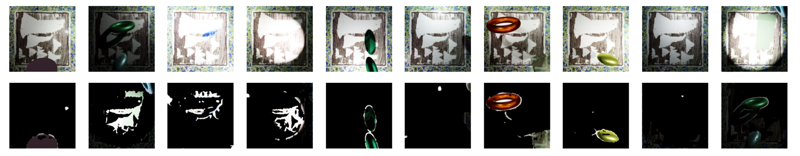
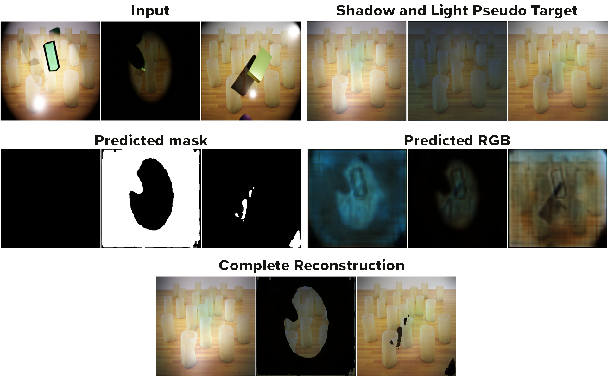

# HTCV: The final advances to the Decomposer model

Guiding the decomposition learning process to reduce ambiguity.
After multiple runs of training the model with our naive loss function approach, we realized that without any ground truths for occlusion, shadow, and light masks, the self-supervised model struggled to distinguish between individual distortions. In many cases, the shadow mask dominated in extracting all distortions + background artifacts from the distorted image. Therefore, to guide the model in the right direction, we made the decision to create pseudo-labels for shadow, light, and occlusion masks. Finally, we split the training into multiple stages, where the goal is to pretrain each head for a specific task separately, based on the pseudo-labels. Note, that each stage is trained on pretrained swin encoder.

## Table of contents
1. [Source Image Reconstruction ](#source-image-reconstruction) \
1.1 [Loss function](#loss-function)
2. [Light and Shadow Mask Reconstruction](#light-and-shadow-mask-reconstruction) \
2.1 [Generating Pseudo Labels](#generating-pseudo-labels) \
2.2 [Loss function](#loss-function)
3. [Occlusion Mask Reconstruction](#occlusion-mask-reconstruction) \
3.1 [Generating Pseudo Labels](#generating-pseudo-labels) \
3.2 [Loss function](#loss-function)
3.2.1 [Binary Mask](#binary-mask) \
3.2.2 [RGB Mask](#rgb-mask)

## Source Image Reconstruction
### Loss function
The first head is designed to reconstruct ground truth for a given sequence of images. For this task we propose a very simple loss, which is MSE between the ground truth and our reconstructed ground truth.
## Light and Shadow Mask Reconstruction
### Generating Pseudo Labels
To compute psedue-label for light, we subtract the distorted image from gt and clip all values below 0. The resulting image is then blurred with a Gaussian filter to remove the remaining artifacts. For the shadow mask, we perform the same operation, however, we first invert the image. 
### Loss function
We train shadow and light extraction together as one stage. For the loss function, we first multiply gt with the shadow pseudo label and add the light pseudo label. We then compare (on MSE) it with gt_reconstruction * predicted_shadow + predicted_light.
## Occlusion Mask Reconstruction
### Generating Pseudo Labels
To generate pseudo labels for the occlusion, we calculate ssim loss between our shadow_light pseudo labels and distorted image. The goal is that regions of the distorted images with occlusion will produce higher loss than regions without occlusion. Finally, we apply adaptive thresholding to calculate the best threshold value for occlusion/non-occlusion regions.

**Fig 3.1:** *Input images (top) and generated occlusion pseudo targets (bottom).*
### Loss function
Again two stages. First Only training to predict binary mask. Then training to predict Mask with RGB values.

#### Binary Mask
BCEWithLogitsLoss. ```True``` values for mask very underrepresented -> Positive Weight computed each batch: Ratio of ```False``` to ```True``` values in batch. \
```torch.nn.BCEWithLogitsLoss(pos_weight=positive_weight)```
#### RGB Mask
MAE of reconstruction and Input. 2 Versions - both with different regularizations.
1. Reconstruction = SL_Target XOR Occ_Mask * Occ_RGB
2. Reconstruction = (Source_Image_Target + light_pred) * shadow_pred XOR (Occ_Mask * Occ_RGB)

***Version 1*** without regularization:
> Insert image

The model learns to simply reconstruct the input image in its occlusion rgb prediction and the binary mask predicts only true values, i.e. the occlusion branch takes over the complete reconstruction like a Autoencoder. \

***Version 1*** with binary mask regularization:
> Insert image

The model again learns to somewhat reconstruct the original image, but the binary mask now also sticks to the noisy binary mask target. Since our targets are very poor, we want them only to be used as a guide and want the model to lern to generalize from there on. This might still be a simple hyperparameter tuning problem as the weighting of the binary mask subloss might be too high. \

***Version 1*** with mask decay regularization:


The model again learns to somewhat reconstruct the original image, but the mask decay term now tells the model to predict as little positives, ie., 1s, as possible. The goal is to regularize strong enough so that the model predicts almost no positives, only when there really is an occlusion. This might still be a simple hyperparameter tuning problem. \
The issue with this approach is that the underlying image with the generated shadows and light images (the sl pseudo targets) are not that accurate, so the occlusion mask really has to rely on it's own RGB input reconstruction. \
But since we have also pretrained and finetuned the gt and sl models to a point where the shadow and light are modeled better than the pseudo labels, we can use the gt and sl models to generate the underlying image instead of using the generated sl pseudo target for the occlusion modeling. \

***Version 2*** with mask decay regularization:
